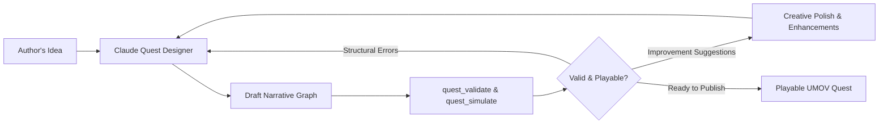

# UMOV Quest Maker

> An AI-powered interactive text quest and story game designer for Claude, integrated with the [UMOV](https://umov.net) gaming and puzzle platform.

[](https://claude.ai)
[](https://backeu.umov.net/mcp)
[](LICENSE)

---

## 🌟 Overview

**UMOV Quest Maker** turns Claude into a professional game master and interactive narrative architect. Whether you want to write a gritty detective noir mystery, a sci-fi space station escape, a gothic horror story, or an educational branching scenario, Quest Maker guides you from the first spark of an idea to a fully validated, playable quest graph.

Under the hood, the plugin communicates with the **UMOV Quest Engine** via a remote Model Context Protocol (MCP) server running in the Netherlands:
```
https://backeu.umov.net/mcp
```

### Key Capabilities

- **Interactive Story Co-Creation:** Brainstorm settings, characters, plot twists, dilemmas, and multiple endings with Claude.
- **Graph Invariant Validation:** Automatically verifies that transitions, node bindings, and requirements are structurally sound using `quest_validate`.
- **Playability Simulation:** Statically checks every possible path via `quest_simulate` to ensure that all locations and endings are reachable and that no players get stuck in accidental dead ends.
- **Ready for Publication:** Generates clean, compliant quest packages ready to be opened in the UMOV visual quest editor or played directly on the web.

---

## 🚀 Installation

### Option 1: Claude Directory (Recommended)
1. In [Claude](https://claude.ai), open the **Directory** / **Integrations** tab.
2. Search for **UMOV Quest Maker**.
3. Click **Add to Claude**.

---

### Option 2: Custom Remote Connector in Claude.ai
1. Go to **Settings** → **Connectors / Integrations** in [claude.ai](https://claude.ai).
2. Click **Add Custom Connector**.
3. Enter the connector details:
   - **Name:** `UMOV Quest Engine`
   - **Endpoint URL:** `https://backeu.umov.net/mcp`
4. Click **Save**. Claude will automatically discover the tools.

---

### Option 3: Claude Desktop Configuration

Add the remote MCP server to your `claude_desktop_config.json`:

```json
{
  "mcpServers": {
    "umov-quests": {
      "type": "remote",
      "url": "https://backeu.umov.net/mcp"
    }
  }
}
```

---

## 🛠️ MCP Tools Reference

The connector provides four tools that Claude uses during the creative process:

| Tool | Type | Description |
|---|---|---|
| `quest_get_capabilities` | Read-only | Returns supported quest types (`investigation`, `walkthrough`), available puzzle engines (`trivia`, `problem`, visual placeholders), reserved facts (`lives`, `coins`, `rating`), and ID rules. |
| `quest_get_schema` | Read-only | Returns the formal JSON Schema for bare quest graphs and versioned `umov.quest-package` bundles. |
| `quest_validate` | Read-only | Authoritative structural validator. Checks for broken edge references, invalid types, cycle issues, and emits JSON-pointer errors, warnings, and non-blocking improvement suggestions. |
| `quest_simulate` | Read-only | Static reachability analyzer. Verifies that all locations are reachable from the start, all endings can be achieved, identifies dead ends, computes max rewards, and offers enhancement hints. |

---

## 📖 How It Works



### Example Authoring Flow

1. **The Premise:**
   > *"I want to create a short detective quest set in Victorian London. The player investigates the theft of an emerald from Lord Blackwood's study. There should be 3 suspects, a hidden safe puzzle, and 2 distinct endings."*

2. **The Architecture:**
   Claude designs a branching tree with:
   - Starting scene: `Foyer of Blackwood Manor`.
   - Clue exploration branches: `Study (Crime Scene)`, `Servants' Quarters`, `Conservatory`.
   - Gatekeeper: Inspecting the fireplace reveals the safe combination (`has_safe_code`).
   - Endings: Correct accusation (`win`), False arrest (`lose`), Betrayed by partner (`end`).

3. **Validation & Simulation:**
   Claude runs `quest_validate` and `quest_simulate` against `https://backeu.umov.net/mcp` to ensure no orphaned nodes or dead ends exist.

4. **Testing in the Sandbox:**
   Once verified, import the JSON directly into the [UMOV Quest Sandbox](https://umov.net/test-quest) to play and refine.

---

## 📂 Repository Structure

```text
quest-maker/
├── .claude-plugin/
│   └── plugin.json          # Claude plugin manifest
├── .mcp.json                # Remote MCP server (umov-quests) config
├── skills/
│   └── quest-designer/
│       └── SKILL.md         # Narrative architect system skill & guidelines
├── evals/                   # `claude plugin eval` suite
├── examples/
│   └── haunted-mansion.json # Fully verified sample branching quest
├── README.md                # Documentation & quick start guide
├── LICENSE                  # MIT License
└── .gitignore               # Standard gitignore
```

---

## 📄 License

Released under the [MIT License](LICENSE). Copyright (c) 2026 voxel99 / UMOV.
